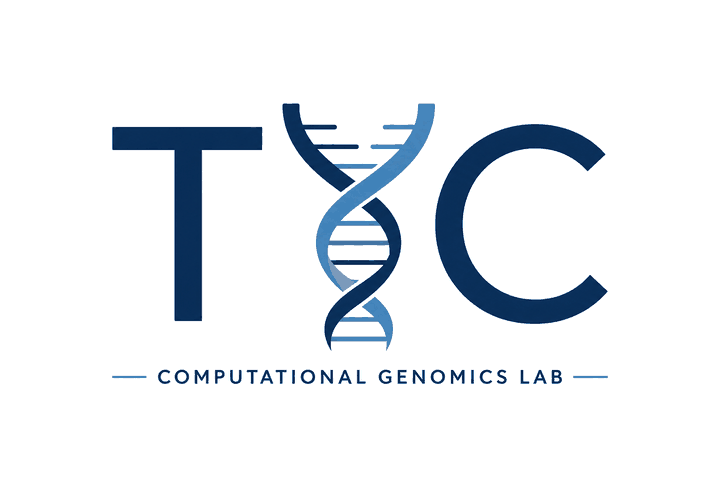

  

# TYC Computational Genomics Lab

We develop computational methods that turn high-dimensional biological data into clinical insight, across four areas:

- **Cancer genomics**: whole-genome sequencing of patient-derived xenograft models
- **Spatial biology**
- **Host–microbe interactions and microbiome population studies**
- **Human genetics and genetic ancestry**

For more information visit our lab website: [katarzynatyc.github.io](https://katarzynatyc.github.io/)

## Publications

Code and processed data behind our published figures, one folder and one release per paper:
**[publications](https://github.com/TYCGenomicsLab/publications)**

| Year | Paper | Code and data |
|------|-------|---------------|
| 2026 | Dashti-Gibson N., *et al.* Pan-cancer comparisons of multi-omics data for therapeutic selection. *Under review* | [2026_DashtiGibson_pancancer](https://github.com/TYCGenomicsLab/publications/tree/main/2026_DashtiGibson_pancancer) |
| 2026 | Tyc K. M., *et al.* Mutational landscape analysis of patient-derived xenograft models across multiple solid tumors and ancestries. *In preparation* | [2026_Tyc_PDX_WGS_landscape](https://github.com/TYCGenomicsLab/publications/tree/main/2026_Tyc_PDX_WGS_landscape) |

## Tools

| Tool | What it does |
|------|--------------|
| [TACIT](https://github.com/huynhkl953/TACIT) | Unsupervised cell-type and cell-state annotation for spatial multiomics (spatial transcriptomics and proteomics) from predefined marker signatures, without training data. R package. Huynh K. L. A., Tyc K. M., *et al.* *Nat Commun* 16, 3747 (2025), [doi:10.1038/s41467-025-58874-4](https://doi.org/10.1038/s41467-025-58874-4) |
| [AncestryProjector](https://github.com/TYCGenomicsLab/AncestryProjector) | Nextflow (nf-core) pipeline that assigns genetic ancestry to study samples from their germline VCF/BCF files by joint analysis with the 1000 Genomes Project high-coverage reference: PCA, ADMIXTURE ancestry fractions, superpopulation and population assignments, and publication-ready figures. |

## Contact

**Katarzyna M. Tyc, PhD** — [katarzynatyc](https://github.com/katarzynatyc); [tyck@vcu.edu](mailto:tyck@vcu.edu)
